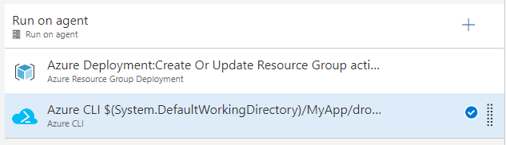
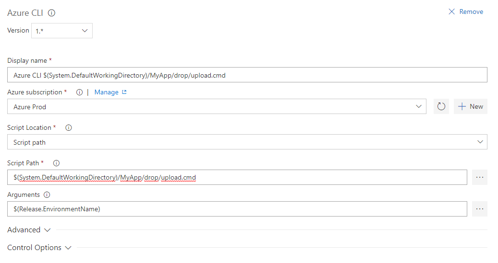

# Setup for deploying on Azure App Service with F# Make

All code is available here: https://github.com/nikolaia/fake-webapp-deploy

This article goes trough deploying to Azure App Service without depending on external services and using scripts that can be run and tested locally.

## Why FAKE

We have been using FAKE (F# Make) in the latest projects I've been part of for some obvious reasons:

Running builds locally. No magic that a build-server controls. No need to commit code, and push it, to see if the Artifact produced by your build is correct. Everything can be done on the developer machine and builds are **reproducible**.

**Source controlled** build-scripts ensure that we can check out old code and still build it. See audits of who changed it, and most important of all: Since the script is part of the repository we can change it in a branch without changing it on the build server, having other branches that don't support these changes fail (Yes we could also clone or copy the build-definition on the build server, but that is boring work and requires someone to clean up later).

FAKE, even though it's a DSL, is valid F# and has **great editor support** in VS Code using the Ionide-extension. It also works inside Visual Studio. We didn't get this from Cake or Psake.

## What does a build script do

FAKE normally has a build.cmd/build.sh file that downloads FAKE from NuGet and then bootstraps your build.fsx file. The simplest build.fsx files usually just calls MSBuild and zips the result, but you can do more advanced things like check if NuGet Packages are consolidated and fail the build if they are not:

```fsharp
type PackageReferenceFile = NuGet.PackageReferenceFile
Target "NuGetPackagesConsolidated" <| fun _ ->
    !! (sprintf "./src/%s*/packages.config" appName)
    -- "**/obj/**/packages.config"
    |> Seq.map PackageReferenceFile
    |> Seq.collect (fun prf -> prf.GetPackageReferences())
    |> Seq.groupBy (fun pr -> pr.Id)
    |> Seq.filter (fun p -> (snd p |> Seq.distinct |> Seq.length) > 1 )
    |> Seq.map (fun p -> fst p , snd p |> Seq.distinct)
    |> function 
        | packages when packages |> Seq.isEmpty -> ()
        | packages -> 
            seq {
                yield "The following packages are not consolidated:"

                for (k,v) in packages do
                    yield (sprintf "    Package: %s Versions: %A" k v)
            
                yield "You need to consolidate packages across the solution:"
                yield "    * Right click on the solution inside VS"
                yield "    * Choose Manage NuGet Packages for Solution"
                yield "    * Choose the Consolidate tab"
                yield "    * Make sure you sync the package versions" }
            |> Seq.iter (printfn "%s")
            failwith "Packages not consolidated"
```

I've gotten feedback that this build-target isn't 100% complete:

> The help advice just needs an "OR JUST USE PAKET" tacked on the end for A+ passive aggression. - https://twitter.com/kent_boogaart/status/935784973512015872

We do several things in our build.fsx. We create a LocalDB instance for integration tests, migrate it up and run end-to-end integration tests against it to test our application.

If all tests pass we create an Artifact. Artifacts, with real version numbers, that are considered candidates for production, are created on the build-server as soon as a Pull Request is approved and merged into the Master branch [TODO: Link master-only/stable-master/github-flow].

## What should a deploy script do

At this point we would previously add a lot of steps and variables in a VSTS Release Definition to put this Artifact in a Azure WebApp, and we would happily go on with our life. However, we soon ran into the same problem that we had with our build before moving the logic from the centralized build-server back into source control: The feedback loop is just to long. Small adjustments to the deploy pipeline would take a long time to test, and if you didn't merge it to master you would have to clone the definition, change all variables and point it at a new app to test until you felt it was safe to merge your changes into master without halting the deployment pipeline for other people working on the same app.

We also decided that we didn't want any magic happening after the artifact was pushed to the Azure WebApp. Kudu, which is the backbone of deployments to Azure WebApps has default buildscripts that it uses to deploy your application. We don't want that, we want a script that can be run on a developers machine. KuduSync, which syncs files from a staging area to the wwwroot of your WebApp can be run locally (https://github.com/projectkudu/KuduSync). Actually all of Kudu can be run locally if you wanna test some more advanced cases (https://github.com/projectkudu/Kudu)! Custom deployment scripts are supported and can easily be FAKE-scripts! AWESOME! We can use the same DSL for our deployscript and our buildscript:

We add a [.deployment](.deployment) file which Kudu will catch up. This is how we tell Kudu we have a custom script, and that it should use our script instead of generating its own:

```ini
[config]
command = deploy.cmd
```

It just tells _Kudu_ to call our [deploy.cmd](deploy.cmd) script which should be familiar to people that have used _FAKE_ before. It ensures that _FAKE_ is available and then calls the _FAKE_ binary with our deployment script:

```cmd
@echo off
cls
if not exist "tools\FAKE\tools\Fake.exe" "tools\nuget.exe" "install" "FAKE" "-OutputDirectory" "tools" "-ExcludeVersion" "-Version" "4.63.2"

"tools\FAKE\tools\Fake.exe" deploy.fsx %* --nocache
```

Our [deploy.fsx](deploy.fsx)-file is what holds the actual logic for deploying:

```fsharp
#r @"tools/FAKE/tools/FakeLib.dll"
#r @"tools/FAKE/tools/Fake.FluentMigrator.dll"

open Fake
open Fake.Azure.Kudu
open Fake.REST

let appName = "MyWebApp.Web"
let connectionStringName = "MyWebAppWeb"

// Access token stuff
let aadInstance = "https://login.microsoftonline.com/"
let tenant = environVarOrFail "AzureAD.Tenant"
let clientId = environVarOrFail "Deploy.Migrator.ClientId"
let certThumbprint = environVarOrFail "Deploy.Migrator.CertThumbprint"
let authority = aadInstance + tenant

// Deployment variables based on the inputs
let hostName = sprintf "%s.Host" appName
let migrationsName = sprintf "%s.Migrations.dll" appName
let kuduConnectionStringName = sprintf "SQLAZURECONNSTR_%s" connectionStringName
let connectionString = environVarOrFail kuduConnectionStringName

Target "MigrateDatabase" <| fun _ ->
    let arguments = sprintf """migrate /connectionString="%s" /clientId="%s" /certThumbPrint="%s" /authority="%s" """ connectionString clientId certThumbprint authority
    let result, messages =
        ExecProcessRedirected
                (fun info ->
                    info.FileName <- sprintf "./%s.Migrations.Runner/%s.Migrations.Runner.exe" appName appName
                    info.Arguments <- arguments
                    info.WorkingDirectory <- __SOURCE_DIRECTORY__)
                (System.TimeSpan.FromMinutes 10.0)

    messages
    |> Seq.iter (fun m -> printfn "%A - %A" m.Timestamp m.Message)

    if not result then
        failwithf "%s.Migrations.Runner.exe returned with a non-zero exit code" appName

Target "KuduStageFiles" <| fun _ ->
    stageFolder hostName (fun _ -> true)

Target "SmokeTests" <| fun _ ->
    let url = sprintf "https://%s.azurewebsites.net/api/health/ping" (environVarOrFail "WEBSITE_SITE_NAME")
    printf ""
    match ExecuteGetCommand "" "" url with
    | response when response.Contains("pong") -> ()
    | _ -> failwith "Endpoint %s did not respond with \"pong\"! Something must be wrong :(" // TODO: Raise alarm even though this should fail the deploy

Target "Deploy" kuduSync

"KuduStageFiles"
    ==> "MigrateDatabase"
    ==> "Deploy"
    ==> "SmokeTests"
    
RunTargetOrDefault "SmokeTests"
```

So we decided that our build-script  should output three things:

- The zip'ed artifact to deploy to the WebApp, including the .deployment, deploy.cmd and deploy.fsx and our console app for migrating the database.
- The ARM-templates for the application. They should be run on every deploy to ensure correct settings, AppSettings and ConnectionStrings.
- A script in a similar style to our buildscript (upload.cmd/upload.ps1) that gets the artifact where it needs to go. It should be  source-controlled and possible to run from the developers machine if need be.

## Uploading our artifact

The normal VSTS WebApp deploy uses ARM to deploy, and it assumes everything in your .zip file is ready to be served from the `wwwroot` folder. Luckily for us, using Azure WebApps and Kudu, there is a Zip Push Deploy option in the Kudu API that lets us push a .zip file and will trigger a deploy in the same way that a Fetch-deploy does: https://github.com/projectkudu/kudu/wiki/Deploying-from-a-zip-file. The upload script in our build-artifacts, that uploads our .zip to Kudu/Azure WebApps is a simple http-call. To get access to the endpoint in a way that would work on both the developer machine and on VSTS, we used the Azure CLI 2.0 command that let's you fetch the access token used by the CLI. This way we just needed our subscription setup in VSTS with our VSTS Azure App Registration/RBAC, and the Azure CLI Step. Now we can run the same script locally as long as we are logged in to the Azure CLI (2.0, the new one). Again our [upload.cmd](upload.cmd) simply bootstraps the actuall script:

```cmd
powershell -file "upload.ps1" -appName %*
```

And the real magic happens inside [upload.ps1](upload.ps1):

```powershell
Param(
    [Parameter(Mandatory=$True,Position=1)]
    [string]$appName
  )

$token = (ConvertFrom-Json -InputObject ([string](Invoke-Expression -Command:"az account get-access-token")))."accessToken"
$bearerToken = "Bearer $token"
$apiUrl = "https://$appName.scm.azurewebsites.net/api/zipdeploy"

$vstsWorkDir = $env:SYSTEM_DEFAULTWORKINGDIRECTORY
$vstsReleaseDefName = $env:RELEASE_DEFINITIONNAME

if ($vstsWorkDir -and $vstsReleaseDefName) {
    $artifactDir = "$($env:SYSTEM_DEFAULTWORKINGDIRECTORY)/$($env:RELEASE_DEFINITIONNAME)/drop"
    $zip = Get-ChildItem -Path $artifactDir -Filter *.zip | Select-Object -First 1
    $zipPath = "$artifactDir/$($zip.Name)"
} else {
    $artifactDir = split-path -parent $MyInvocation.MyCommand.Definition
    $zip = Get-ChildItem -Path $artifactDir -Filter *.zip | Select-Object -First 1
    $zipPath = "$artifactDir/$($zip.Name)"
}

Write-Host "Calling $apiUrl with $zipPath using token '$bearerToken'"
Invoke-RestMethod -Uri $apiUrl -Headers @{Authorization=$bearerToken} -Method POST -InFile $zipPath -ContentType "multipart/form-data"
```

Now we can easily deploy from a release management tool like VSTS. One step do apply the ARM-template, and a second for running `deploy.cmd`:



The Azure CLI step would look like this:

